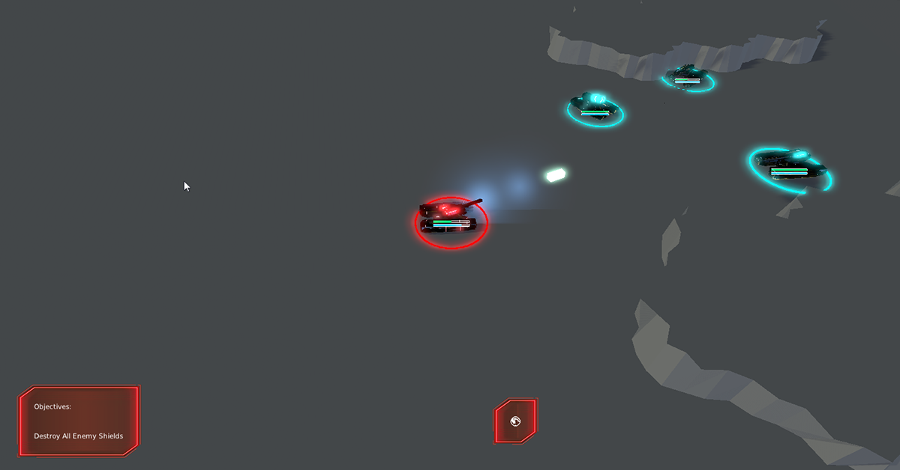
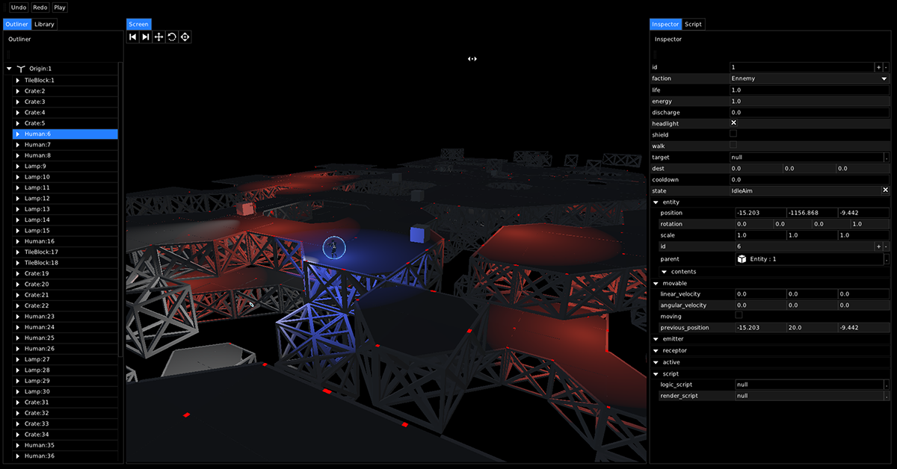
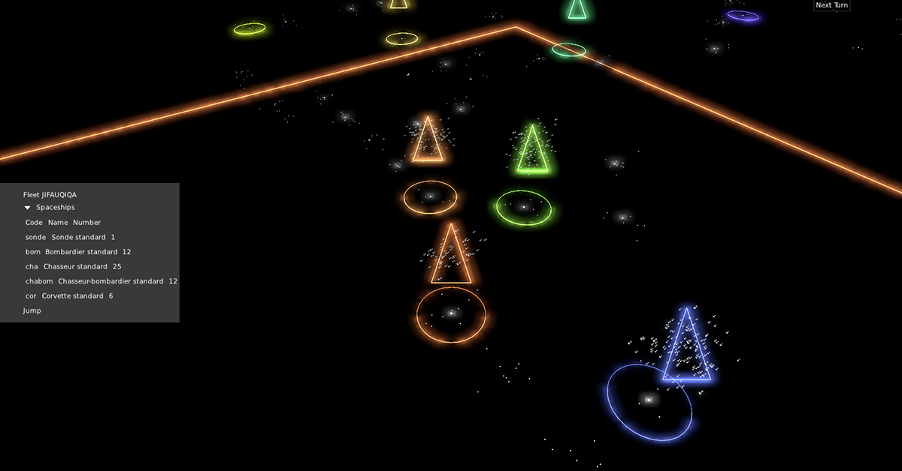

| CI            | Community     | Support   |
| ------------- | ------------- | --------- |
  |   | 

toy is a **thin and modular c++ game engine**. it aims to provide the **thinnest and simplest stack of technology** for making games **directly from c++**. toy offers **simple expressive c++ idioms** for [user interface](), [rendering](), [audio](),  and the seamless extension of your game code with **zero-cost** [tools](), [editors]() and [scripting](), to design full featured 2d or 3d games in **fast iterations**. toy is built on top of the underlying [two](https://github.com/hugoam/two) library, which provides most functionality.

**toy is under heavy development, not yet stable, fully documented or production ready. this mean we can't guarantee any kind of stability yet (including the git history too)**

toy simplicity and modularity makes it deeply **hackable**, **extensible** and **versatile**. toy is perfect to build games with **atypical constraints**: complex user interface and rendering schemes, procedural generation, etc. it provides a **fully programmable 3d renderer**, with full control over *shaders, materials and render paths*, as well as higher level primitives and systems such as **entities**, **physics**, **navmesh generation and navigation**, and **procedural generation** helpers.

As a collection of game programming **building blocks**, toy aims to foster an ecosystem of **simple minimal reusable components** suited for **building your own game technology**.

Note: I've released toy, for the time being, under the **GPL v3.0** license, hoping for it to evolve into a truly free and open-source technology, by releasing under a **more permissive license**: however this can only happen if it secures a regular financial support, to ensure it's funded as an open-source project: this is where your help comes into play :)

### live demo

Try [a live demo](https://hugoam.github.io/toy-io/ex_godot.html) in this gorgeous lightmapped scene ported to toy engine from godot (also beware that it includes potentially loud sound):

### principles
- **simple and lightweight**, simplicity is the core aim and philosophy behind toy. the codebase is about one-tenth the size of competing engines, and toy is so light, the whole editor runs in your browser !
- **modular**, each functionality is enclosed in a small, simple, easy to understand code building block. most of these blocks lie in the underlying two library.
- **extensible**, as a collection of modules, toy is a perfect fit to build your own game technology, keeping full control over the components you use, the application design and the control flow.
- **game code first**, toy is first and foremost meant to build games in native c++ code, in direct contact with the core systems. this allows for much greater control than typical scripting in-engine.
- **versatile**, toy is designed from the start with complex games in mind, such as strategy or role playing games, by giving full control over its powerful user interface and rendering systems.
- **zero-cost tools**, reflection automatically extends your game core code for seamless scripting, editing, inspection of your game objects, types and procedures in the built-in tools/editor.
- **educative**, toy aims to provide simplest technical solutions to typical game programming problems, easily studied and understood, hoping to be a driver of education on game development topics.
- **fast iteration**, coupling seamless bindings of both built-in systems and game code to various scripting languages, hot-reload of native code, and immediate UI and rendering, toy provides fast iteration speeds.

### features
- **two** is the low-level library providing most of the base features behind **toy**, in separate modules
  - reflection
  - **scripting**: Reflection automatically extends your game core code for seamless scripting via text-based languages (lua, Wren), and a node visual-scripting language, including interfaces for editing these. toy scripting component is so lean, it can be added to the game itself, for live scripting or for an in-game console.
  - rendering
  - **user interface**: A simple expressive user interface API is the fundamental block for writing any robust game or application. toy offers the best-in-class : immediate-mode widget declarations, fully automatic layout, css-like skinning, image-based skinning, style sheets, various input widgets, docking windows and tabs.
- entity
- physics
- navigation

### roadmap
toy is mostly feature complete in terms of the basic features we wanted for a minimal viable engine. this mean it could finally be open-sourced. but toy is still a bit unstable and undocumented: that means it is in a transitory phase, where the pace can settle down for a while, allowing to:
- iron out all the bugs, crashes, instabilities
- thoroughly document all the classes and functionalities which will remain stable

this is the step that toy will be during the next month or so.

after that, when toy is a robust, stable and fully documented game engine foundation, there are many features which will bring toy in a more cutting-edge category: this is what I will be working on next, and by supporting two you will help us implement the following features:
- **tool applications**: implement minimal tooling apps, including: a model painter, an animation editor, a particle editor, a prefab/scene editor. most of these features are partly implemented, but a set of standalone apps would be a great addition.
- **scripting languages**: implement support for Wren, Javascript, and C# scripting.
- **clustered rendering**: implement state-of-the-art clustered rendering techniques, along with a deferred rendering pipeline.
- **real-time global illumnation**: investigate state-of-the-art global illumination techniques and implement the best real-time compromise currently feasible.
- **node-based shader language**: the two node editor is a perfect tool to start playing with node-based shader and render pipeline definitions.
- **multi-threading**: implement efficient job/fibers system and parallelize everything that can be.
- **performance-focused ECS**: implement an ECS skeleton focused towards heavily parallelized performance, to implement typical scenarios such as the boid example.
- **networking**: investigate how a networking solution can be integrated with reflection, how to automatically expose objects procedures and fields through a networking API, to provide seamless basic multiplayer support, then implement it.

### get started
- have a look at the [manual](Manual.md)
- clone and [build toy](#how-to-build)

### examples

| Platform Example        | RTS Example             |
| ----------------------- | ----------------------- |
|  |       |

| Editor Example        | Space Example         |
| --------------------- | --------------------- |
|  |   |

### how to build
- `git clone https://github.com/hugoam/toy --recursive`
- `cd toy`
- generate the project files for your target
  - `bin/linux/genie --gcc=linux-gcc gmake` for gmake/linux
  - `bin/windows/genie vs2015` for Visual Studio 2015
  - `bin/windows/genie vs2017` for Visual Studio 2017
- go to the generated folder
  - `cd build/projects/gmake-linux` for gmake/linux
  - `cd build/projects/vs2015` for Visual Studio 2015
  - `cd build/projects/vs2017` for Visual Studio 2017
- build
  - `make config=debug64 -j8` for gmake/linux 64bit
  - open `toy.sln` and build for Visual Studio
- run the examples: `ex_platform`, `ex_space`, `ex_blocks`

### credits
toy couldn't exist without:
- [GENie](https://github.com/bkaradzic/GENie) build system
- [bgfx](https://github.com/bkaradzic/bgfx) rendering library
- [vg-renderer](https://github.com/jdryg/vg-renderer) and [NanoVG](https://github.com/memononen/nanovg) vector drawing libraries
- [lua](https://github.com/lua/lua) scripting language
- [stb](https://github.com/nothings/stb) headers
- [glm](https://github.com/g-truc/glm) math library
- [json](https://github.com/nlohmann/json) header

### sponsors
Creating toy has been a huge time investment over the course of a few years: the only way I can pursue that effort and make it thrive into the game programming ecosystem of our dreams, is through funding and sponsorship: you are welcome to have a look at our [patreon](https://www.patreon.com/toyengine).

Iron supports:
- Mike King

Stone supports:
- Etienne Balit, Le Bach, Manos Agelidis, Nebo Milic, Omar Cornut, Stefan Hagen, Sunder Iyer

### license
two is licensed under the [GPLv3 license](LICENSE.txt)
