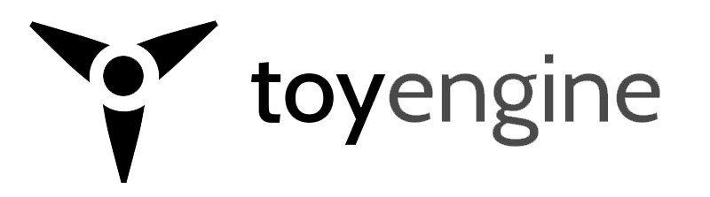

# toy
toy is a **small, simple, code oriented, modular** *c++ game engine*.  

toy puts the emphasis on games made of **simple, expressive native c++ code** extended through **tools, editors and scripting**, to design full featured 2d or 3d games in **fast iterations**.

Focused on **versatility** at the core, it gives full control over its **expressive rendering and user interface systems**, making it suitable to build **any kind of game**.

Designed for **quick iterations** and experimentation, it is deeply **hackable**, entirely **scriptable**, and provides a **fully programmable 3d renderer**, giving you direct access to *shaders, materials and render paths*.

As a collection of game programming **building blocks**, it also aims to foster an ecosystem of *simple minimal reusable components* for everyone, and it is suited for **building your own game technology**.

On top of these fundamentals, toy adds plenty of game programming systems such as physics, a navigation system, procedural generation algorithms, many tools, and more.

# examples
here are 3 live toy demo games: a [strategic space sim game](), a [tanks real time strategy game](), and a [procedural platformer]() game.

they were designed to showcase toy strongest features, and aspects that are notably hard to achieve using other engines:
- real-time procedural generation of world geometry
- complex user interfaces intertwined with game logic
- code-based dynamic rendering of thousands of instances
- custom rendering paths and custom shaders
- physics based game logic

each of these examples is written in less than a hundred lines of code and the source is fully available: reading these examples is the first place to start learning how to write a game with toy.

# overview
overarching principles:
- **simple and lightweight**, simplicity is the ultimate aim and philosophy behind toy, and toy is so lightweight, even the engine editor can be run on the web
- **modular**, each functionality is enclosed in a small, simple, easy to understand code building block
- **extensible**, as a collection of modules, toy can be used to build your own game technology out of a subset of components fitting your use case, complemented by your own functionalities
- **game code first**, toy is first and foremost meant to write games in native c++ code, directly, effortlessly, in direct contact with the fundamental systems
- **versatile**, typical engines are often biased towards specific kinds of games (platformers, shooters), toy on the other hand has been designed from the start with unconventional or complex games in mind, such as *real time strategy games* or *role playing games*. this is mostly enabled by its emphasis on native game code, and the powerful user interface and rendering systems.
- **tools second**, reflection automatically extends your game core code for seamless scripting, editing, inspection of your game objects, types and procedures in the built-in tools/editor. 
- **custom tools**, the modularity coupled with the beauty of the reflection and ui system, makes writing your own tools one of the strikingly easy things enabled by toy
- **educative**, toy is meant to be taken apart and studied, each technical solution aims to be a "most common denominator", a potential example of a minimal solution to a given problem
- **fast iteration**, providing seamless bindings of both built-in systems and game code to various scripting languages, as well as an experimental hot-reload of native code, the aim is to bring iteration speed to the maximum possible

features:
- **mud** is the low-level library providing most of the base features behind **toy**, in separate modules
  - reflection
  - scripting
  - rendering
  - user interface
- entity
- physics
- navigation

# intent
toy stems from the curious wandering mind of a child: **how do you make a game** ? what's the **machinery** behind it ? how **complex** is it ? what are all the **individual steps** to put a game experience together ? can it be **simple** ? can **all these steps be simple** ? can I **understand** each of them ? can I design a game **myself**, using some **building blocks** and armed with that understanding ?

toy is the result of a quest to demonstrate that the machinery required **can** be simple, given enough effort to make it so; to design such building blocks, and to make them accessible to everyone to write their games, whether they are young beginners, lone coders, indie teams, or AAA teams, with a stack of technology that they can master, understand, adapt, and extend easily.

### educative
toy strives for **education and accessibility of game development techniques and knowledge**, by pushing for simple, accessible, auditable building blocks. particularly, toy wishes to take down the idea that the technical machinery behind games is of the highest complexity, and could be grasped and mastered only by a select few, by providing not only the components to make games from scratch, but an example of **how simple these components can be**.

in doing so, toy hopes to be studied by aspiring game developers, and hopes to show them a potential example of how some typical game engine design mistakes can be avoided by selecting slightly different or simplified idioms.

### simple
**simplicity** is the **core and most important principle underlying toy**. toy aims to lower the *quantity of information* necessary to define a specific game to its *lowest possible value*. by reducing the complexity of the technology needed to make a game, both user-facing and underlying, toy sets to reduce the *cognitive overhead* that can cripple down many projects progress.

in general, toy is allergic to "inversion of control" object-oriented designs, and prefers top-down, high-level-to-low-level imperative control flows. this as well as other design decisions allows toy to fit in a whopping 80 thousands lines of code. many engines similar in scope go in the >500 kloc range.

### modular
every component of toy is hosted in a **clearly separated module** solving **one specific task**. most of these are part of the [mud]() library, which is the *foundation* layer of toy, with the building blocks common to building applications in general: reflection, serialization, scripting, math, geometry, rendering, user interface, and sound. toy adds modules for **entities, physics, navigation**.

this modularity ensures that toy is **easy to understand and adapt**, the opposite of a *big ball of mud*, and that toy is *perfectly suited* to be partly incorporated in your **own custom game technology**.

### hackable

### ecosystem
the vision of toy is to foster an **ecosystem** of **low-level building blocks and libraries for building games**, which aren't *necessarily* part of toy itself: for each technical function, toy wants a **self-contained, small, minimalist library fullfilling that function**. if one exists already, toy uses that one. for example, mud uses: [glfw](), [bgfx](), [OpenAL](), [recast](), [bullet](), and many more. toy is only affected by NIH syndrome when such focused and minimal components **don't exist yet**.

### code first
toy puts **native code** at the forefront of the development of your game. toy is first and foremost meant to write games in native c++ code, directly, effortlessly, **in direct contact with the fundamental systems**. this ensures that toy is on the cutting edge, both in **performance and versatility**, and a fit for both big traditional development teams as well as single indie developers.

typical engines are often biased towards specific kinds of games (platformers, shooters). that bias is created by the tooling, and of the editor worflow. toy, by putting the emphasis on native code, and **direct access to its powerful user interface and rendering systems**, is designed from the start with unconventional or complex games in mind, such as real time strategy games or role playing games. 

toy will provide minimalist templates demonstrating how each type of game can be easily implemented. until then the primary source of information is the code of the examples, which illustrate how a game archetype is easily assembled by connecting the different systems.

this doesn't mean that toy doesn't include scripting: on the contrary, toy automatically extends both built-in systems, and user code through the reflection system, to ensure **complete and seamless access of through both text scripts and visual scripts**. if you want, toy gives you the ability to code your game **completely in a scripting language**.

### tools second
toy powerful reflection system automatically extends your game core code for **seamless scripting, editing, inspection** of your game objects, types and procedures in the built-in tools/editor. 

in toy, there is no such thing as a monolithic editor: tools are independent reusable blocks, using the expressive strength of the ui system, to provide user operations for specific components (for example, manipulating scene entities), or, using the power of reflection, operating in a generic manner on any object.

this approach is key to empowering development teams, by enabling them to **design and use their own custom suite of editors** tailored to the **needs of the specific game they are working on**. an editor, in that design, is simply a collection of tools bound together by an overarching user interface managing global state and credentials.

toy provides a range of tools, such as a **scene outliner, a generic object inspector, a text script editor, a visual script editor**, and others. a team that doesn't need any custom tools can just build the editor template provided by toy, which bundles together all those built-in tools in a nice sleek editor.

rather than try to provide too many built-in tools from the start, toy bets on an ecosystem of specialized tools growing progressively, thanks to a terribly simple and expressive user interface paradigm, and the clear and open outline of the engine core systems. first, the basics, then tools for animating, painting, assembling will naturally evolve.

### programmable rendering

### procedural generation

# how to build

on linux :

```bash
git clone https://github.com/hugoam/toy --recursive
cd toy
bin/genie --gcc=linux-gcc gmake
cd build/projects/gmake-linux
make config=debug64 -j8
```
